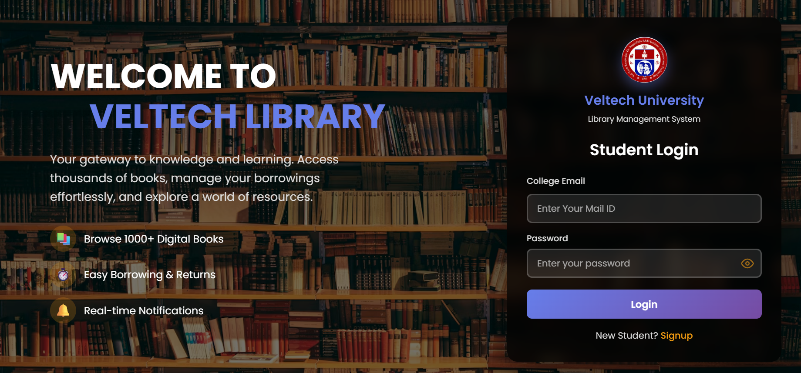
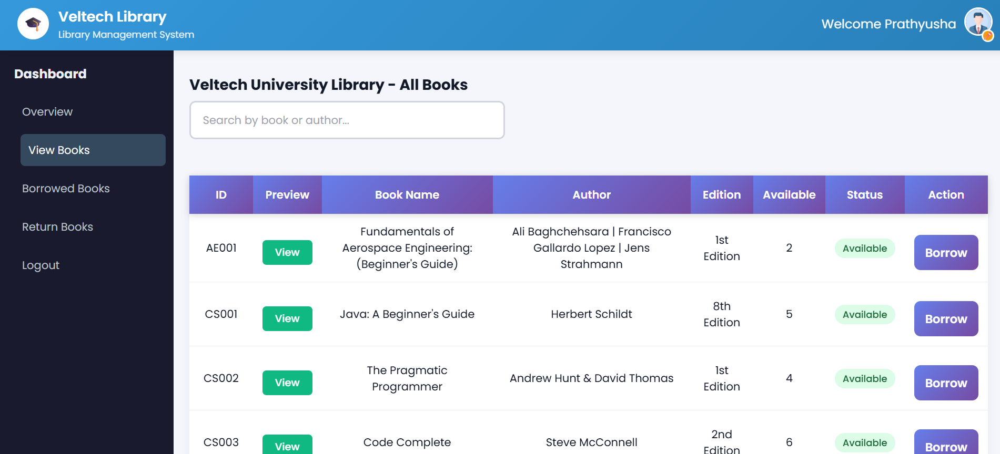
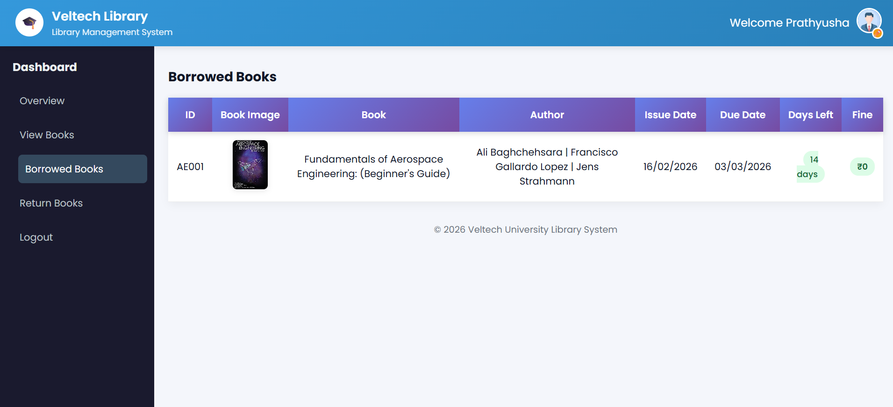
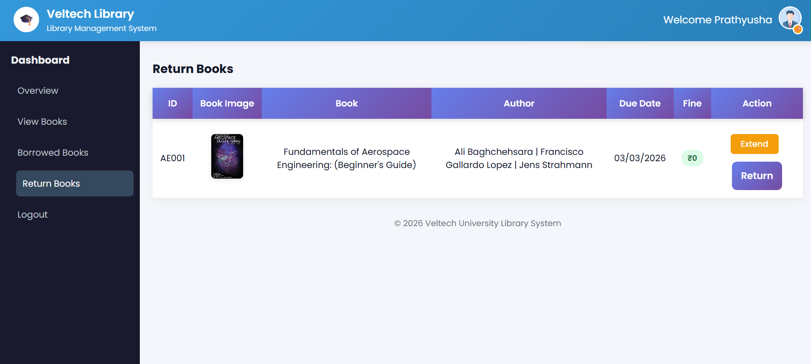

# 📚 Library Management System – Full Stack Project

A professional full-stack Library Management System developed using Java, Spring Boot, MySQL, HTML, CSS, and JavaScript.  
This system digitizes library operations such as book tracking, student login, issue/return management, and fine calculation.

Designed for real-world usage and placement-level full stack demonstration.

---

## 🚀 Live Features

✔ Student login system  
✔ Admin dashboard  
✔ Add & manage books  
✔ Issue and return books  
✔ Fine calculation (₹10 per week)  
✔ Search books functionality  
✔ Clean modern UI  
✔ Database connected with MySQL  
✔ Real-time backend using Spring Boot  

---

## 🛠️ Tech Stack

### 👨‍💻 Frontend
- HTML5  
- CSS3  
- JavaScript  
- Responsive UI design  

### ⚙️ Backend
- Java  
- Spring Boot  
- JDBC  
- REST APIs  

### 🗄️ Database
- MySQL  

### 🔧 Tools Used
- VS Code  
- IntelliJ IDEA  
- Git & GitHub  

---

## 📸 Project Screenshots

### 🔐 Login Page

### 📚 Dashboard

### ➕ View Book Page

### 📖 Issue Book

### 📖 Return Book

---

## 💻 How to Run Project

1. Clone repository
2. Open backend in IntelliJ
3. Configure MySQL in application.properties
4. Run Spring Boot application
5. Open frontend index.html in browser

---

## 🎯 Project Purpose
This project was built for:
- Software developer placements
- Full stack practice
- Real-time project experience
- Interview demonstration

---

## 👨‍💻 Developed By
**K HARIKA**   
Java Full Stack Developer  
DSA | Java | MySQL | System Design  

---

## ⭐ If you like this project
Give this repo a ⭐ on GitHub
